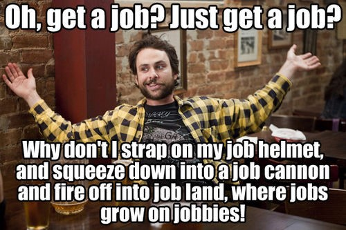
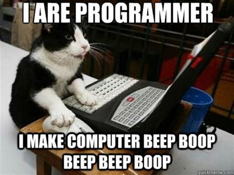

#### TLDR
I got degrees in things that gave me debt and no real job I loved. Got sick, literally sick, at my job and
decided it was time to figure something out. A friend mentored me and within 4 months I got my first dev job!

#### Extended History
I spent a bunch of money I didn't have and received a BA in Philosophy. It was fun! 
Learned to think more logically and get new perspective... BUT didn't get me a job. Still fun though.

After that I got married, had a kid and decided that maybe... maybe I should do something to 
make enough money for a family.

I loved learning and wished I could just keep going to college etc. So what I decided was to 
get a master's degree in Educational Technology, also known as Instructional Design. I'd be 
able to create trainings, on everything. So I'd keep learning everything as I made different 
things for different people. In fact I did some freelancing for awhile and made trainings for 
pest control technicians, an online MBA program in Australia, and a cooking course in an 
applied technical college.

BUT... alas that didn't last long. It seems that most people in my cohort in my MEd. program 
already had a job in training and were getting education to move up in their company.

While I spent a bunch of money I didn't have... again, to get that MEd. 

I also was working for Apple doing tech support part time. Eventually I did that full time... and grew to... dislike 
it, to put it in nice words. It wasn't hard, but it was boring and I didn't fit the culture at the time. Wasn't very 
fulfilling (to me that is). I was even getting anxious and stomach aches thinking about going 
to work. Dreading it every day. I wanted and needed to get out of there.

During all that time I was messing around with spreadsheets and getting deeper and deeper in 
Google App Script making silly things. Made a spreadsheet with birthdays that a script would 
check every day around 7 AM, and text a special message I wrote to the birthday person. Super 
cool, huh? I also made a spreadsheet script for emailing people to remind them when their 
lease was ending, their new lease amount and other templated information.

#### The Moment
So I was having fun doing that and getting stomach aches before going to work at a dead end 
job. Then BAM! My friend Kasey saw what I was doing with spreadsheets and scripts and pushed 
me to learn how to code. My wife and I talked about it and I convinced her to go to work full 
time while I paid a baby sitter to watch the kids while I learned how to code with some 
guidance from my friend.

About 4 months later I won! I got a job with my friend's company because I convinced them I 
wasn't a jerk and was a fast learner. YAY! There was probably some other technical stuff I 
showed them too, but yeah. I did it!

#### Now
Fast forward to now, 2 year later. Learned a ton more. I'm building React Native apps along 
with all the other normal, HTML, CSS, JavaScript, ReactJS, PHP, and blah or whatever. I've also 
found that I want to help other people. I started looking for people to help and mentor into 
JavaScript. It has been fun! Met some nice people and have really enjoyed it.

I've been looking for more ways to help mentor others and keep learning. This blog will talk 
about it. Keep checking in.

