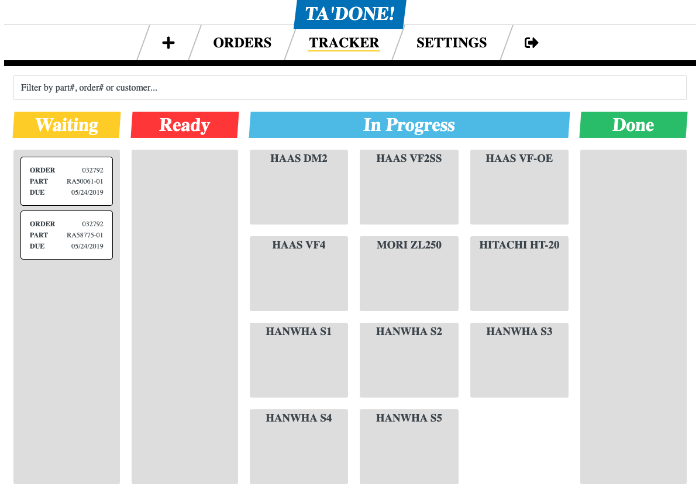

Finally! I deployed my first ever version 1 project. I've started
many projects before but hadn't pushed thru to get them published and live.
This time I did it.

### What's the story?
Last year I had been looking for projects to build, maybe something that would
end up making me money. I asked several family and friends for ideas. I
listened to podcasts about side hustles and these types of projects, or
start-ups. I found that most often they stumble into a good business idea.

For instance there was a story of a company making software for plumbers to
find customers. They made a great project and had businesses trying to
use them but many were back out and disappear. They decided to look into how
these businesses were using their product. They found that these small 
businesses were struggling with other things and would end up bailing on
their product or not giving it enough attention. Their main issue was
organizing themselves and tracking paper work.

The business pivoted and focused on helping small businesses with their
paperwork and tracking. They became a huge success after stumbling onto
the need of their customers.

This is what I was trying to do. I found a friend that has a manufacturing
business as a machine shop machining parts from metals. He told me they
have poor order/part tracking and would love to have something simple.
Of course that kind of software already exists but not specific to his
industry that also doesn't have a ton of things he doesn't want to pay for.
I worked on it for the last 3-4 months and finally deployed a week ago!

### What is it?
I built a a customized version of a kanban board specific to his shop/industry.
Pretty simple at first glance, a drag and drop list of todos with specific
machines to do them on and a finished section. I built on that idea and
features as I went. Soon I'll have analytics built in so that he can look
back and see what employees are working the most efficiently, what customers
provide the most profits, what parts are loosing them money, etc.

### Conclusion
He already started showing his team and will start utilizing it next week.
Because it was a success he brought me another idea of an app to build for
his sisters company that they'll pay for in full, where this current project
I own and will be charging for monthly and start selling to other shops.
